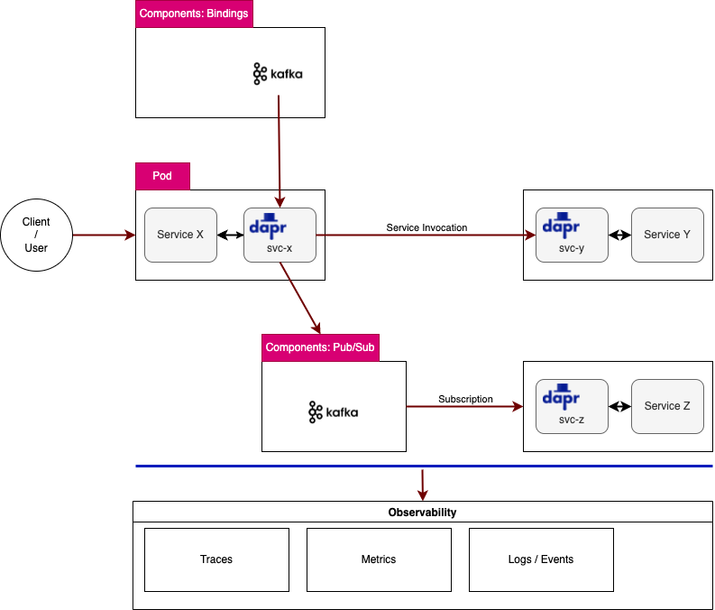

# dapr-playground

Dapr?

https://dapr.io
> Dapr is a portable, event-driven runtime that makes it easy for any developer to build resilient, stateless and stateful applications that run on the cloud and edge and embraces the diversity of languages and developer frameworks. Leveraging the benefits of a sidecar architecture, Dapr helps you tackle the challenges that come with building microservices and keeps your code platform agnostic.


## Dapr CLI

```
# https://docs.dapr.io/getting-started/install-dapr-cli/
# Mac (arm64)
$ arch -arm64 brew install dapr/tap/dapr-cli
$ dapr --version

(snip)

```

## Dapr on Kubernetes

```
# Via CLI
$ dapr init --kubernetes --wait

# Via Helm
helm repo add dapr https://dapr.github.io/helm-charts/
helm repo update
# See which chart versions are available
helm search repo dapr --devel --versions

$ helm upgrade --install dapr dapr/dapr \
--namespace dapr-system \
--create-namespace \
--set global.ha.enabled=true \
--set global.logAsJson=true \
--devel

# local (e.g., k3s)
$ helm upgrade --install dapr dapr/dapr \
--namespace dapr-system \
--create-namespace \
--set global.logAsJson=true \
--devel

```

[KEDA](https://keda.sh/) for Auto scaling:
```
$ helm repo add kedacore https://kedacore.github.io/charts
$ helm repo update
$ helm install keda kedacore/keda --namespace keda --create-namespace
```


## Configuration

https://docs.dapr.io/operations/configuration/

- Control plane Configuration
```
kubectl edit configurations/daprsystem --namespace dapr-system

-- Once the changes are saved, perform a rolling update to the control plane:
kubectl rollout restart deploy/dapr-sentry -n dapr-system
kubectl rollout restart deploy/dapr-operator -n dapr-system
kubectl rollout restart statefulsets/dapr-placement-server -n dapr-system
```

- Application Configration
```
  annotations:
    dapr.io/enabled: "true"
    dapr.io/app-id: "nodeapp"
    dapr.io/app-port: "3000"
    dapr.io/config: "myappconfig"

# Sidecar configuration

apiVersion: dapr.io/v1alpha1
kind: Configuration
metadata:
  name: myappconfig
  namespace: default
spec:
  tracing:
    samplingRate: "1"
  httpPipeline:
    handlers:
      - name: oauth2
        type: middleware.http.oauth2
  secrets:
    scopes:
      - storeName: localstore
        defaultAccess: allow
        deniedSecrets: ["redis-password"]
  accessControl:
    defaultAction: deny
    trustDomain: "public"
    policies:
    - appId: app1
      defaultAction: deny
      trustDomain: 'public'
      namespace: "default"
      operations:
      - name: /op1
        httpVerb: ['POST', 'GET']
        action: deny
      - name: /op2/*
        httpVerb: ["*"]
        action: allow
```


## Dapr Dashboard

TBD

## Samples

```
$ git clone https://github.com/dapr/quickstarts.git
$ cd quickstarts

# https://github.com/dapr/quickstarts/tree/master/tutorials/hello-kubernetes
$ cd tutorials/hellp-kuberntes
```

```
# state store (redis)
$ kubectl apply -f ./deploy/redis.yaml

## nodejs app with dapr sidecar
$ kubectl apply -f ./deploy/node.yaml
$ kubectl apply -f ./deploy/python.yaml

```

## Developing applications

### HTTP / SDKs

TBD

```
# Service invocation
curl http://localhost:3602/v1.0/invoke/checkout/method/checkout/100
```

```
try (DaprClient client = (new DaprClientBuilder()).build()) {
  // invoke a 'GET' method (HTTP) skipping serialization: \say with a Mono<byte[]> return type
  // for gRPC set HttpExtension.NONE parameters below
  response = client.invokeMethod(SERVICE_TO_INVOKE, METHOD_TO_INVOKE, "{\"name\":\"World!\"}", HttpExtension.GET, byte[].class).block();

(snip)
```

### Building blocks


System Architecture for PoC



### Service Invocation


A deployment for Dapr app.:
```
apiVersion: apps/v1
kind: Deployment
metadata:
  name: dapr-demo
  labels:
    app: dapr-demo
spec:
  replicas: 1
  selector:
    matchLabels:
      app: dapr-demo
  template:
    metadata:
      labels:
        app: dapr-demo
      annotations:
        # dapr
        # https://docs.dapr.io/reference/arguments-annotations-overview/
        dapr.io/enabled: "true"
        dapr.io/app-id: "dapr-demo"
        dapr.io/app-port: "8080"
        dapr.io/sidecar-listen-addresses: "0.0.0.0"
        dapr.io/enable-api-logging: "true"
        dapr.io/log-level: "debug"
        #dapr.io/config: myconfig

(snip)
```

```
# HTTP
# GET/POST/PUT...
curl -X GET http://localhost:{DAPR_HTTP_PORT}/v1.0/invoke/dapr-demo/method/world/100

```

### Publish & subscribe

Prerequisites:
- [Kafka](kafka/)
- [Redis](redis/)

Pub/Sub flow with Dapr


A component "kafka-pubsub":
```
apiVersion: dapr.io/v1alpha1
kind: Component
metadata:
  name: kafka-pubsub
  namespace: default
spec:
  type: pubsub.kafka
  version: v1
  metadata:
  # https://docs.dapr.io/reference/components-reference/supported-pubsub/setup-apache-kafka/
  - name: brokers
    value: "my-cluster-kafka-bootstrap.kafka.svc.cluster.local:9092"

(snip)
```

```
$ kubectl get components
NAME            AGE
kafka-binding   3h47m
kafka-pubsub    172m

```

Publishing a message to Kafka:
```
# pubsub.kafka
$ curl -X POST http://localhost:{DAPR_HTTP_PORT}/v1.0/publish/kafka-pubsub/test -H "Content-Type: application/json" -d '{"orderId": "100"}'

```

Subscribe to topics
```
Dapr provides two methods by which you can subscribe to topics:

Declaratively, where subscriptions are defined in an external file.

E.g., 
- https://github.com/dapr/samples/blob/master/pub-sub-routing/components/subscription.yaml
- https://docs.dapr.io/developing-applications/building-blocks/pubsub/howto-publish-subscribe/

  @PostMapping(path = "/checkout")
  public Mono<Void> handleMessage(@RequestBody(required = false) CloudEvent<String> cloudEvent) {
    return Mono.fromRunnable(() -> {
      try {
       // Do something...
      } catch (Exception e) {
        throw new RuntimeException(e);
      }
    });

Programmatically, where subscriptions are defined in user code.

E.g., https://github.com/dapr/java-sdk/blob/master/examples/src/main/java/io/dapr/examples/pubsub/http/SubscriberController.java

```

### Binding


Specifying a custom route?
```
By default, incoming events will be sent to an HTTP endpoint that corresponds to the name of the input binding. You can override this by setting the following metadata property:

name: mybinding
spec:
  type: binding.rabbitmq
  metadata:
  - name: route
    value: /onevent
```

## Dapr in production on Kubernetes

https://docs.dapr.io/operations/hosting/kubernetes/kubernetes-production/

1. HA
- TBD

2. Auto scaling
- HPA or KEDA

3. CI/CD
- TBD

4. Exposing the services or APIs
- Exposing the Dapr APIs via Dapr-ized Nginx ingree controller
  - https://carlos.mendible.com/2020/04/05/kubernetes-nginx-ingress-controller-with-dapr/
  - https://www.atmosera.com/blog/kubernetes-dapr-and-azure-identity-example-part-v/
  ```
  curl -k -H "Host: hydra" "https://<ingress ip>/v1.0/invoke/dni/method/api/validate?dni=54495436H"
  ```
- Nginx IC "rewrite target"
  - TBD


## Observability

https://docs.dapr.io/operations/monitoring/

- Traces


https://docs.dapr.io/operations/monitoring/tracing/open-telemetry-collector/

## Operations

Updating Components:
```
# Kubernetes
When running in Kubernetes, the process of updating a component involves two steps:

1. Applying the new component YAML to the desired namespace
2. Performing a rollout restart operation on your deployments to pick up the latest component

```

## FAQs

- Pub-Sub vs. Binding ??
  - https://github.com/dapr/quickstarts/issues/404
  ```
  In general, pub-sub is for dapr-to-dapr communication. Bindings are for integration with external services.
  ```
- dapr service on Kubernetes ??
  - https://github.com/dapr/dapr/issues/3794
- Serverless(Function or FaaS) vs. Microservices
  - https://fathomtech.io/blog/microservices-vs-serverless/
  - https://www.sumologickorea.com/blog/microservices-vs-serverless-architecture/
  - https://www.techmagic.co/blog/serverless-vs-microservices-which-architecture-to-choose/
  - [Containers + Dapr vs Functions as a Service](https://www.youtube.com/watch?v=Rp4orZYdqSw)
- Dapr vs. Service Meshes(Linkerd, Istio...)
  - https://docs.dapr.io/concepts/service-mesh/

## Refs.

- https://dapr.io/
- https://docs.microsoft.com/en-us/dotnet/architecture/dapr-for-net-developers/
- https://blog.devgenius.io/sneak-peek-into-the-dapr-distributed-application-runtime-world-9dca2b76584b
- https://blog.devgenius.io/sneak-peek-into-the-dapr-distributed-application-runtime-world-9dca2b76584b#_Running_Example
- https://github.com/quarkiverse/quarkus-dapr
- [Microservice Architecture](https://microservices.io/index.html)
- https://charliedigital.com/2021/07/07/dapr-and-azure-functions-part-5a-deploying-to-aws-with-ecr-and-eks-fargate/
- https://github.com/Azure/dapr-java-workshop
- https://code.benco.io/dapr-store/