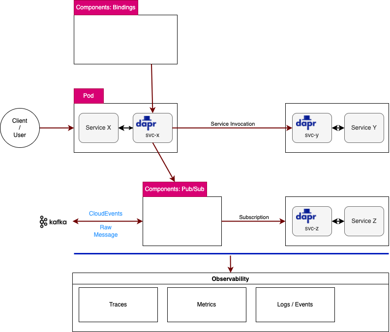

# dapr-playground

Dapr?

```
Dapr is a portable, event-driven runtime that makes it easy for any developer to build resilient, stateless and stateful applications that run on the cloud and edge and embraces the diversity of languages and developer frameworks. Leveraging the benefits of a sidecar architecture, Dapr helps you tackle the challenges that come with building microservices and keeps your code platform agnostic.
```


https://dapr.io

## Dapr CLI

```
# https://docs.dapr.io/getting-started/install-dapr-cli/
# Mac (arm64)
$ arch -arm64 brew install dapr/tap/dapr-cli
$ dapr

(snip)

```

## Dapr on Kubernetes

```
# Via CLI
$ dapr init --kubernetes --wait

# Via Helm
helm repo add dapr https://dapr.github.io/helm-charts/
helm repo update
# See which chart versions are available
helm search repo dapr --devel --versions

$ helm upgrade --install dapr dapr/dapr \
--namespace dapr-system \
--create-namespace \
--set global.ha.enabled=true \
--set global.logAsJson=true

```

[KEDA](https://keda.sh/) for Auto scaling:
```
$ helm repo add kedacore https://kedacore.github.io/charts
$ helm repo update
$ helm install keda kedacore/keda --namespace keda --create-namespace
```


## Dapr Dashboard

TBD

## Samples

```
$ git clone https://github.com/dapr/quickstarts.git
$ cd quickstarts

# https://github.com/dapr/quickstarts/tree/master/tutorials/hello-kubernetes
$ cd tutorials/hellp-kuberntes
```

```
# state store (redis)
$ kubectl apply -f ./deploy/redis.yaml

## nodejs app with dapr sidecar
$ kubectl apply -f ./deploy/node.yaml
$ kubectl apply -f ./deploy/python.yaml

```

## Developing applications

### HTTP / SDKs

TBD

```
# Service invocation
curl http://localhost:3602/v1.0/invoke/checkout/method/checkout/100
```

```
try (DaprClient client = (new DaprClientBuilder()).build()) {
  // invoke a 'GET' method (HTTP) skipping serialization: \say with a Mono<byte[]> return type
  // for gRPC set HttpExtension.NONE parameters below
  response = client.invokeMethod(SERVICE_TO_INVOKE, METHOD_TO_INVOKE, "{\"name\":\"World!\"}", HttpExtension.GET, byte[].class).block();

(snip)
```

### Building blocks



### Service Invocation


A deployment for Dapr app.:
```
apiVersion: apps/v1
kind: Deployment
metadata:
  name: dapr-demo
  labels:
    app: dapr-demo
spec:
  replicas: 1
  selector:
    matchLabels:
      app: dapr-demo
  template:
    metadata:
      labels:
        app: dapr-demo
      annotations:
        # dapr
        # https://docs.dapr.io/reference/arguments-annotations-overview/
        dapr.io/enabled: "true"
        dapr.io/app-id: "dapr-demo"
        dapr.io/app-port: "8080"
        dapr.io/sidecar-listen-addresses: "0.0.0.0"
        dapr.io/enable-api-logging: "true"
        dapr.io/log-level: "debug"
        #dapr.io/config: myconfig

(snip)
```

```
# HTTP
# GET/POST/PUT...
curl -X GET http://localhost:{DAPR_HTTP_PORT}/v1.0/invoke/dapr-demo/method/world/100

```

### Publish & subscribe

Prerequisites:
- [Kafka](kafka/)
- [Redis](redis/)

A component "kafka-pubsub":
```
apiVersion: dapr.io/v1alpha1
kind: Component
metadata:
  name: kafka-pubsub
  namespace: default
spec:
  type: pubsub.kafka
  version: v1
  metadata:
  # https://docs.dapr.io/reference/components-reference/supported-pubsub/setup-apache-kafka/
  - name: brokers
    value: "my-cluster-kafka-bootstrap.kafka.svc.cluster.local:9092"

(snip)
```

```
$ kubectl get components
NAME            AGE
kafka-binding   3h47m
kafka-pubsub    172m

```

Publishing a message to Kafka:
```
# pubsub.kafka
$ curl -X POST http://localhost:{DAPR_HTTP_PORT}/v1.0/publish/kafka-pubsub/test -H "Content-Type: application/json" -d '{"orderId": "100"}'

```

### Binding

1. Kafka Input Binding & Output Binding


Trigger? https://docs.dapr.io/developing-applications/building-blocks/bindings/howto-triggers/
```
If using HTTP, you need to listen on a POST endpoint with the name of the binding as specified in metadata.name in the file.
```

Specifying a custom route?
```
By default, incoming events will be sent to an HTTP endpoint that corresponds to the name of the input binding. You can override this by setting the following metadata property:

name: mybinding
spec:
  type: binding.rabbitmq
  metadata:
  - name: route
    value: /onevent
```

## Dapr in production on Kubernetes

https://docs.dapr.io/operations/hosting/kubernetes/kubernetes-production/

1. HA
- TBD

2. Auto scaling
- HPA or KEDA

3. CI/CD
- TBD

4. Exposing the services or APIs
- Exposing the Dapr APIs via Dapr-ized Nginx ingree controller
  - https://carlos.mendible.com/2020/04/05/kubernetes-nginx-ingress-controller-with-dapr/
  - https://www.atmosera.com/blog/kubernetes-dapr-and-azure-identity-example-part-v/
  ```
  curl -k -H "Host: hydra" "https://<ingress ip>/v1.0/invoke/dni/method/api/validate?dni=54495436H"
  ```
- Nginx IC "rewrite target"
  - TBD


## Observability

https://docs.dapr.io/operations/monitoring/

- Traces


## FAQs

- Pub-Sub vs. Binding ??
  - https://github.com/dapr/quickstarts/issues/404
  ```
  In general, pub-sub is for dapr-to-dapr communication. Bindings are for integration with external services.
  ```
- dapr service on Kubernetes ??
  - https://github.com/dapr/dapr/issues/3794
- Serverless(Function or FaaS) vs. Microservices
  - https://fathomtech.io/blog/microservices-vs-serverless/
  - https://www.sumologickorea.com/blog/microservices-vs-serverless-architecture/
  - https://www.techmagic.co/blog/serverless-vs-microservices-which-architecture-to-choose/
  - [Containers + Dapr vs Functions as a Service](https://www.youtube.com/watch?v=Rp4orZYdqSw)

## Refs.

- https://dapr.io/
- https://blog.devgenius.io/sneak-peek-into-the-dapr-distributed-application-runtime-world-9dca2b76584b
- https://blog.devgenius.io/sneak-peek-into-the-dapr-distributed-application-runtime-world-9dca2b76584b#_Running_Example
- https://github.com/quarkiverse/quarkus-dapr